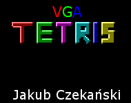
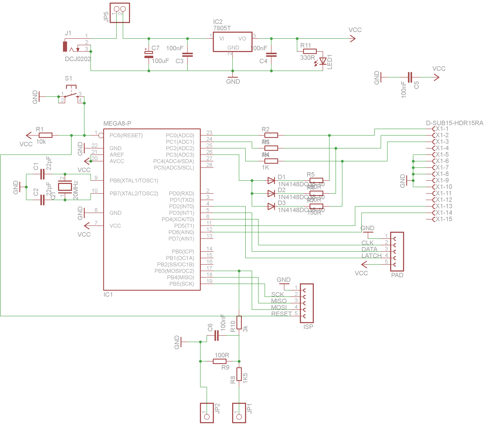
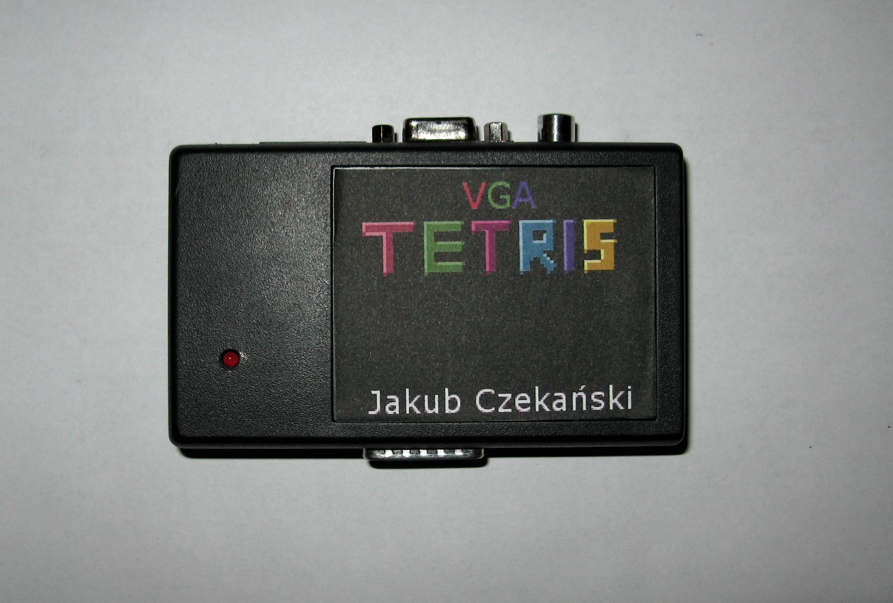
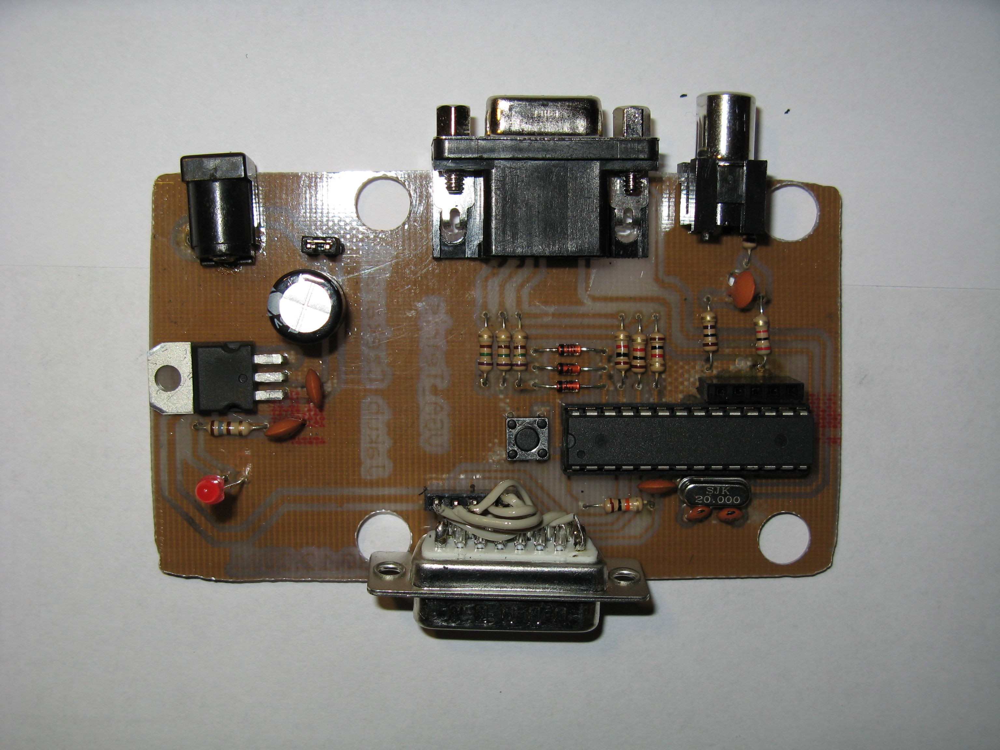

## VGA Tetris - assembly, atmega8, software vga

Yeah, I know. Yet another tetris. But how mine clone is different?  
- Architecture - it's not a PC, smartphone or cellphone, I've created my own platform based on 8bit microcontroller
- Code - I decided to write whole game in assembly
  
License: MIT
  
Specification
Processor: Atmega8 (8kB flash, 1kB SRAM) 
Graphics: 104x120px, 16colors 
Input: Gamepad from Pegasus (Polish Famicom clone) (8 buttons) 
Audio: Mono, generated using PWM (unfortunately, not implemented, not enough time) 
  

  
# Why?  
Project was made for contest on Elektroda.pl (Retro game). Contest was a good motivation for learning AVR architecture from the low level (assembly).  
Also I've learned how to generate VGA image in software and I have managed to carry my project from an idea in my mind to physical, working device.  
  

# Result?  
Finished and working "console" with clone of Tetris, second place in a contest, above 2000 lines of code in pure assembly, pride from finishing a project (from game project, schematics, PCB to working console).
  

# What is so hard?  
The fact, that I don't have a library like SDL or Allegro, where I call function to display image on a monitor. I don't have any functions, operating system or even something like BIOS. Everything was implemented from scratch, including video generation line by line (the graphics card job) where I had to count instruction cycle based, in other case the video becomes desynchronized or was displayed wrong. Next I've implemented high level functions like displaying a tile and later - fonts and images.
  

Presentation (in Polish):  

https://www.youtube.com/watch?v=FwZ4Or7Z6ZU

  
More info (in Polish): http://www.elektroda.pl/rtvforum/topic2177246.html  
  
Linus "lft" Akesson has made a demo on this micro - VGA display, chiptune music, awesome effects, must see!
http://www.linusakesson.net/scene/craft/  
  
Zobacz plik "vga_generacja" jeżeli interesuje cie temat generowania obrazu VGA.  